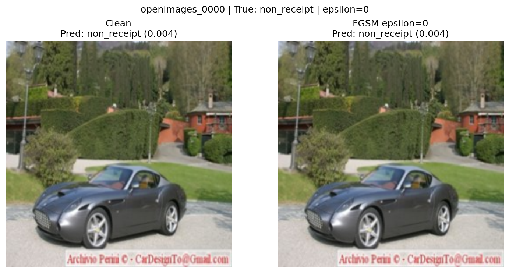
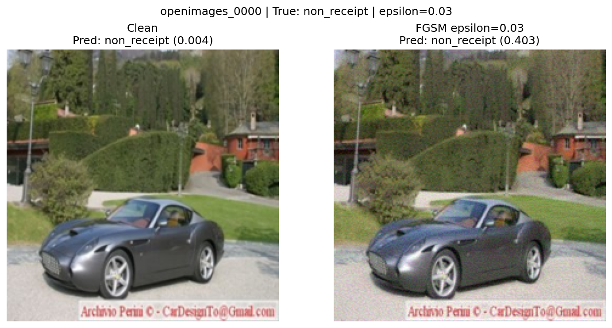
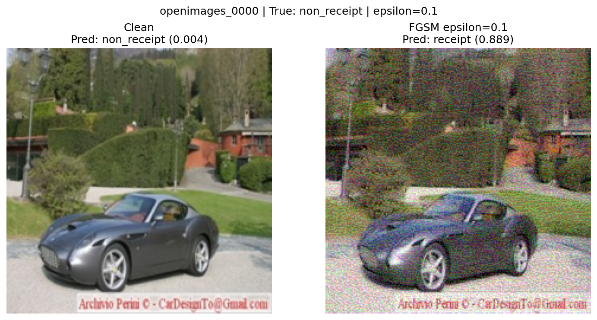

# FGSM Evasion Attack Results

## Clean Model Baseline

- **Model:** ReceiptCNN
- **Test accuracy:** 0.9436
- **Precision:** 0.9943 | **Recall:** 0.8923 | **F1:** 0.9405
- **FGSM baseline:** at epsilon=0.0, accuracy matches the baseline

## FGSM Results

| Epsilon | Clean Accuracy | Adversarial Accuracy | Attack Success Rate |
|---------|---------------|---------------------|-------------------|
| 0.000 | 0.9436 | 0.9436 | 0.0000 |
| 0.010 | 0.9436 | 0.8077 | 0.1440 |
| 0.030 | 0.9436 | 0.5103 | 0.4592 |
| 0.050 | 0.9436 | 0.3000 | 0.6821 |
| 0.100 | 0.9436 | 0.2718 | 0.7120 |
| 0.150 | 0.9436 | 0.4462 | 0.5272 |

## Visual Evidence

<!-- visualize_fgsm() saves one PNG per epsilon under attacks/results/01_fgsm/.
     Embed each one below and add a sentence on what you notice at that epsilon
     (e.g. when noise becomes visible, when the prediction flips). -->

All six images use `openimages_0000`, a photo of a car (true label: non_receipt). The clean model is very confident it's not a receipt (0.004).

**Epsilon 0.000:** The two images are identical and the score matches the baseline. This confirms the attack code itself doesn't change anything when there's no perturbation.

**Epsilon 0.010:** No visible difference. The receipt score rises from 0.004 to 0.052, but the prediction is still correct.

**Epsilon 0.030:** The image has some graininess to it, but the image looks very close to the original. The score jumps to 0.403, which is just under the 0.5 cutoff.

**Epsilon 0.050:** The prediction flips. The model now calls the car a receipt with 0.839 confidence. The image is more grainy, mostly visible in the pavement and the car, but the photo still looks very similar to the original.

**Epsilon 0.100:** The image is misclassified as a receipt (0.889). The noise is quite obvious now. The image is very grainy.

**Epsilon 0.150:** The image is quite bad visually now, but the prediction flipped back to non_receipt (0.112). At this epsilon size FGSM is probably changing the image too much, leading to overshoots, which matches the rise in overall accuracy at 0.15 in the results table.

## Analysis

1. At what epsilon does accuracy drop below 50%? 0.05
2. How do you interpret the attack success rate? The expense system is not very robust, since an FGSM attack with a relatively small epsilon (0.03) can successfully fool the classifier almost 50% of the time.
3. Would these perturbations be visible to a human? At low epsilons (0.010-0.030), the changes are barely noticeable. At higher epsilons (0.050-0.150), the noise becomes more obvious.
4. What are the implications for the expense system? The system can be fooled by adding subtle noise to images, potentially allowing fraudulent receipts to be accepted.
