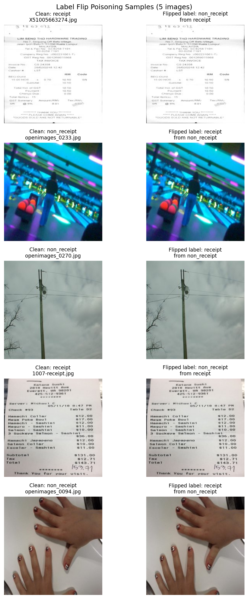
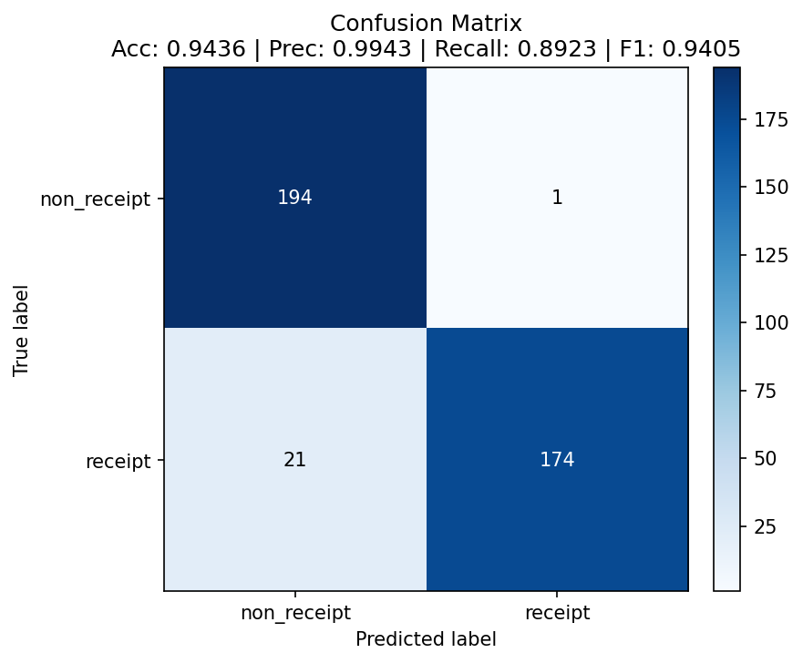
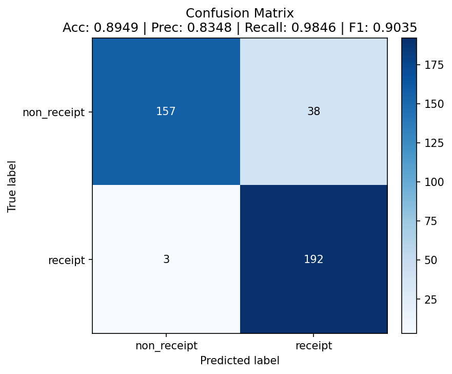

# Data Poisoning Results

## Attack Configuration

- **Method:** Label-flip poisoning
- **Flip rate:** ~5% per class
- **Labels flipped:** 56 out of 1,154 training images (28 receipt → non_receipt, 28 non_receipt → receipt)
- **Goal:** Show that mislabeling a small fraction of the training data, without changing any images, is enough to change how the model behaves on a clean test set.

## Label Flip Evidence

As you can see from the above images, the attack changed the image labels, not the images.

## Baseline (Clean Model)

| Metric | Value |
|--------|-------|
| Accuracy | 0.9436 |
| Precision | 0.9943 |
| Recall | 0.8923 |
| F1 Score | 0.9405 |

## Poisoned Model

| Metric | Value |
|--------|-------|
| Accuracy | 0.8949 |
| Precision | 0.8348 |
| Recall | 0.9846 |
| F1 Score | 0.9035 |

## Impact Analysis

| Metric | Clean | Poisoned | Change |
|--------|-------|----------|--------|
| Accuracy | 0.9436 | 0.8949 | −0.0487 |
| Precision | 0.9943 | 0.8348 | −0.1595 |
| Recall | 0.8923 | 0.9846 | +0.0923 |
| F1 | 0.9405 | 0.9035 | −0.0370 |

## Confusion Matrices (Optional)

## Key Findings

1. How significant is the accuracy drop? Accuracy fell from 94.4% to 89.5%. Although that sounds modest, the model went from almost never accepting a non-receipt (1 out of 195) to accepting 38 of them, nearly 1 in 5.

2. Which class was more affected and why? non_receipt. The model now leans toward calling things receipts: false positives went from 1 to 38. The flips were even (28 each way), so the imbalance comes from how the model learned from them. The likely reason is that the 28 non-receipts labelled as receipts are varied photos (cars, scenes, objects), which teaches the model that many kinds of images can be receipts. 

3. What do the confusion matrices tell you? The clean model's mistakes were almost all missed receipts (21 of its 22 errors). The poisoned model's mistakes are almost all non-receipts accepted as receipts (38 of its 41 errors). The total number of errors roughly doubled, but the type of error flipped completely, and it flipped in the direction that matters most for fraud.

4. What are the implications of this attack? Someone who can influence the training data can weaken the classifier without touching any images. Mislabeling less than 5% of the data made the system accept about 20% of non-receipt images as receipts.
